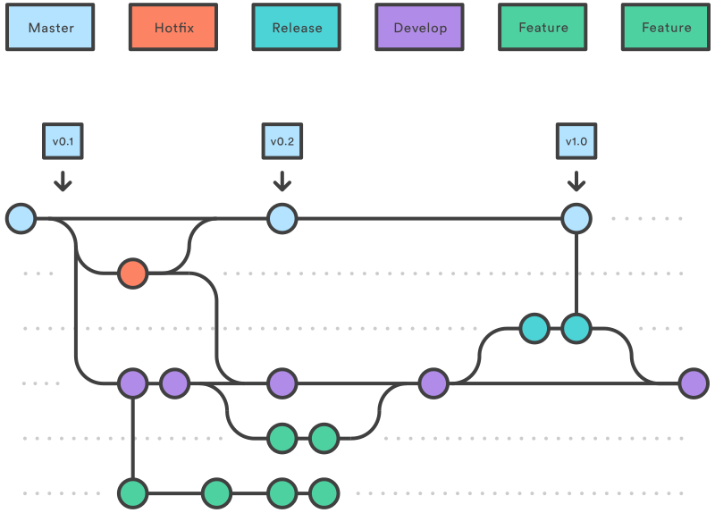

# Developer Workflows

When working with Git most teams use one of two different workflows depending on their preference.

- [Feature branch workflow](https://www.atlassian.com/git/tutorials/comparing-workflows/feature-branch-workflow) (also known as [GitHub flow](https://guides.github.com/introduction/flow/))
- [Gitflow](https://www.atlassian.com/git/tutorials/comparing-workflows/gitflow-workflow)

Though FBW is the simpler of the two, it should be used by teams that are confident whenever they change the **master** branch it still remains ready for production ([Master is always shippable](https://github.com/DEFRA/software-development-standards/blob/master/principles/coding_principles.md#master-is-always-shippable)).

Gitflow is useful for teams that like the space to combine multiple features, or are working on a large feature, before then shipping to production.

## Feature branch workflow (GitHub flow)

[Source: GitHub Docs - Get started](https://docs.github.com/en/get-started/start-your-journey/hello-world)

Using this workflow we only use two branches

- **Master** is the main branch developers work from. It represents the latest version of the code. The key principle is that master is always production ready. Anything merged in needs to have been peer reviewed, passed by CI, and ready for release.

- A **Feature** branch is started each time we want to add to, update or fix something in the code. We branch off Master when creating the feature, and once complete merge it back in

## All branches

In all cases when the branch is created it should be pushed up to the **origin** repo and a pull request created as per the [pull request](../processes/pull_requests.md) process.

## Gitflow

[Source: Atlassian Tutorials - Comparing Workflows](https://www.atlassian.com/git/tutorials/comparing-workflows/gitflow-workflow)

Using this workflow it means our branches have specific uses

- **Master** is the version of code that is in production (see the principle [Master is always shippable](https://github.com/DEFRA/software-development-standards/blob/master/principles/coding_principles.md#master-is-always-shippable))

- We create a **Hotfix** branch when we need to make a change to production code because of a critical error. When finished we merge the change back into Master, but also Develop

- **Develop** is the main branch the developers work from. It represents the current version of the code, including new features we’ve completed but not yet released. You should make this the [default branch](https://help.github.com/en/articles/setting-the-default-branch) in GitHub

- A **Feature** branch is started each time we want to add to, update or fix something in the code. We branch off Develop when creating the feature, and once complete merge it back into Develop

- Once we have a set of features we want to put live, we create a **Release** branch. Last minute fixes and tidying up is done on this branch and then it is merged into Master (put live) and back into Develop

### Use of tools

There are a number of tools you can use to help you with gitflow, for example tools such as [Sourcetree](https://www.sourcetreeapp.com/) have support built in, and you can add support to git [via extensions](https://github.com/nvie/gitflow).

However these all assume that merging will be done locally and then pushed to the origin repo. Because we create pull requests on all the branches we create, and merge them using the GitHub web UI it means we cannot use these tools for merging.

So feel free to use them for creating your branches, however you may find it easier to simply manually create your branches and just ensure you stick to gitflow's naming convention.
