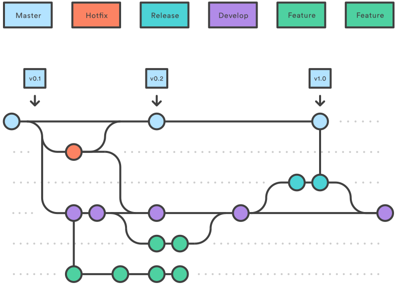

# Developer Workflows

When working with Git there are two different workflows teams commonly use.

- [Feature branch workflow](https://www.atlassian.com/git/tutorials/comparing-workflows/feature-branch-workflow) (also known as [GitHub flow](https://guides.github.com/introduction/flow/))
- [Gitflow](https://www.atlassian.com/git/tutorials/comparing-workflows/gitflow-workflow)

This guide sets out the pros and cons of each, to help teams choose the workflow that best fits their context.

Teams should favour GitHub flow by default because it is simpler to operate and aligns well with continuous integration and the GOV.UK Service Standard expectation of frequent, low-risk delivery. Teams should still assess which workflow best fits their context before deciding.

## Choosing a workflow

Consider the following when choosing a workflow:

- what release cadence the business can support, and how often you need or want to release to production
- whether you need to combine or coordinate multiple features before releasing them together
- your team's size, experience and familiarity with Git and CI practices
- your ways of working, for example release governance, sign-off or coordination across teams
- whether your hosting platform constrains your choice

As a rule, prefer GitHub flow where your service can release frequently and keep **main** shippable through strong CI and code review. Consider Gitflow where the business needs a lower release cadence or a formal process to batch and coordinate changes before release.

### Core Delivery Platform (CDP)

Teams hosting their service on the [Core Delivery Platform (CDP)](https://portal.cdp-int.defra.cloud/documentation) must use GitHub flow, as CDP only supports this workflow.

### Main is always shippable

GitHub flow depends on the [main is always shippable](https://github.com/DEFRA/software-development-standards/blob/main/docs/principles/coding_principles.md#main-is-always-shippable) principle. To use it safely, teams need to be confident that whenever they change the **main** branch it still remains ready for production.

## Feature branch workflow (GitHub flow)

[Source: GitHub Docs - Get started](https://docs.github.com/en/get-started/start-your-journey/hello-world)

Using this workflow we only use two branches

- **main** is the main branch developers work from. It represents the latest version of the code. The key principle is that main is always production ready. Anything merged in needs to have been peer reviewed, passed by CI, and ready for release.

- A **Feature** branch is started each time we want to add to, update or fix something in the code. We branch off main when creating the feature, and once complete merge it back in

**Pros**

- simpler, with only two types of branch to manage (**main** and **Feature**)
- creates less merge overhead, as there are fewer long-lived branches to keep in sync, so fewer conflicts
- supports frequent, continuous delivery to production
- easier to review, as changes tend to be small and frequent
- simple for new starters, as there's only one branch type to learn
- required if hosting on CDP

**Cons**

- relies on strong CI and review discipline, as main must always stay releasable
- harder to batch or coordinate multiple features into a single release
- offers no staging area separate from production
- incomplete or risky work usually needs feature flags to keep main releasable
- harder to support multiple versions in production at once, for example patching an older release while newer work continues

## All branches

In all cases when the branch is created it should be pushed up to the **origin** repo and a pull request created as per the [pull request](../processes/pull_requests.md) process.

## Gitflow

[Source: Atlassian Tutorials - Comparing Workflows](https://www.atlassian.com/git/tutorials/comparing-workflows/gitflow-workflow)

Using this workflow it means our branches have specific uses

This model can suit teams that need stronger release staging and coordination, at the cost of more branch management complexity.

- **main** is the version of code that is in production (see the principle [main is always shippable](https://github.com/DEFRA/software-development-standards/blob/main/docs/principles/coding_principles.md#main-is-always-shippable))

- We create a **Hotfix** branch when we need to make a change to production code because of a critical error. When finished we merge the change back into main, but also Develop

- **Develop** is the main branch the developers work from. It represents the current version of the code, including new features we’ve completed but not yet released. You should make this the [default branch](https://help.github.com/en/articles/setting-the-default-branch) in GitHub

- A **Feature** branch is started each time we want to add to, update or fix something in the code. We branch off Develop when creating the feature, and once complete merge it back into Develop

- Once we have a set of features we want to put live, we create a **Release** branch. Last minute fixes and tidying up is done on this branch and then it is merged into main (put live) and back into Develop

**Pros**

- supports batching or coordinating multiple features into a single release
- provides a staging area (**Develop**) separate from production
- gives a clear, separate path for hotfixes to production
- better suited where a formal release or sign-off process is needed before going live
- easier to support multiple versions in production concurrently

**Cons**

- more branch types to manage, with more merge overhead and conflict risk
- extra syncing needed between **Develop** and **main**
- slower feedback, as work sits in **Develop** before reaching production
- more for new starters to learn, with more branch types and rules
- not supported on CDP

### Use of tools

There are a number of tools you can use to help you with gitflow, for example tools such as [Sourcetree](https://www.sourcetreeapp.com/) have support built in, and you can add support to git [via extensions](https://github.com/nvie/gitflow).

However these all assume that merging will be done locally and then pushed to the origin repo. Because we create pull requests on all the branches we create, and merge them using the GitHub web UI it means we cannot use these tools for merging.

So feel free to use them for creating your branches, however you may find it easier to simply manually create your branches and just ensure you stick to gitflow's naming convention.
