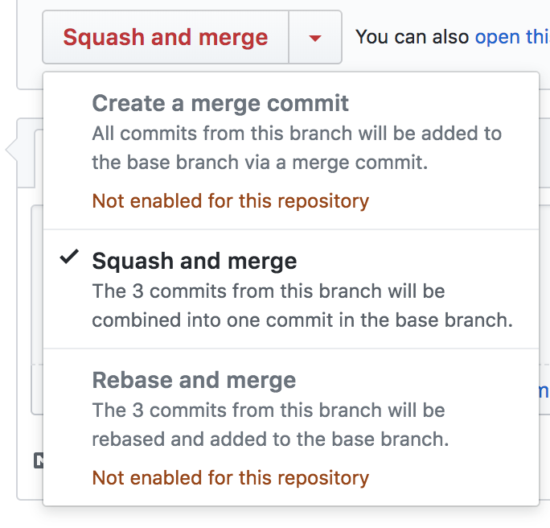

# Pull requests

The following outlines how to make changes to a repo. The goals are

- Focused PR's related to specific changes
- Code review is simple and manageable
- A clean tree of changes in the commit history
- Consistency across the commits

We also want to respect the time and effort of those reviewing the work. Keeping PR's small, focused and consistent makes their life easier.

## Always on a branch

No matter how small the change, all changes should be done on a branch and never directly to `master`. This is to support the principle of [Master is always shippable](https://github.com/DEFRA/software-development-standards/blob/master/principles/coding_principles.md#master-is-always-shippable)

Clone the repo then create your new branch. For example `git checkout -b add-ea-admin-area-lookup`.

## Start with a commit

Start your new branch with an empty commit.

```bash
git commit --allow-empty
```

The template for the commit is the following

```text
50 character limited title

Link to originating story/bug/card in relevant system (e.g. Jira or Trello)

Description covering why we're making this change, and briefly what the change is.
```

For example

```text
Handle empty params in ValidatePreUpdate method

https://eaflood.atlassian.net/browse/WAS-1096

This change fixes an issue found with `validate_pre_update_organisation_address` in that when passed empty parameters it would cause an `undefined method all? for nil:NilClass` error to be thrown.
```

The key point is that it should cover **the actual change you are intending to make**, and not just repeat **what the backlog story outlined**. The link to the story is added for those that need that greater context.

### Commit message rules

1. Separate subject from body with a blank line
1. Limit the subject line to 50 characters
1. Capitalize the subject line
1. Do not end the subject line with a period
1. Use the imperative mood in the subject line (*Add ability* not *Added ability*)
1. Use the body to explain *what and why* vs. *how*

N.B. The source for these is [How to write a Git commit message](http://chris.beams.io/posts/git-commit/) which you're encouraged to read.

## Let everyone know

Next push your branch.

```bash
git push -u origin add-ea-admin-area-lookup
```

We create a PR right from the start so that your proposed change is visible to all. This means everyone can feedback if they see any issues, and give help and advice.

Once pushed you'll need to go to GitHub to actually create the PR. Typically it will highlight the new branch in the UI and provide a quick option to create the PR. You'll then see GitHub automatically takes your first empty commit and uses it to populate the pull request title and description. Nice! Assign yourself to the PR so everyone knows the work is with you.

## Now code

Now get on and code. You should commit frequently and push often. Don't worry too much about your commit messages here. But don't ignore them completely as they will be used as part of the PR process (so keep `WIP`, `Still WIP`, and `More WIP!` to a minimum thank you!)

## Keep up to date

It's on you to keep your branch up to date with with your main development branch e.g. *master*. Using `rebase` rather than `merge` will mean no merge messages appearing in your PR's commit history, but its not required. To `rebase` on *master* use

```bash
git rebase origin/master
```

## Get it looked at

When you're finished and have pushed your last commit request someone to review it. If there are multiple members on your team and all could review, feel free to request them all. The key thing is at least one other person should review the PR before it is merged.

You and the reviewer will then work to confirm the changes are OK. Once the reviewer is happy they need to **approve it**.

## Completing the PR

Once approved to complete the PR you'll need to `squash` your commits down to one.

The simplest way to do this is in the GitHub UI. Within the PR the merge button for new repo's will say `Squash and merge`. Else you may need to click the down arrow next to the button to select it.



When you click it GitHub will present a box which contains the combined text from all the commit messages in the PR. Use this opportunity to reword the content to a single commit message (the smaller the change the simpler this is to do!)

When done ensure you delete the branch. Again GitHub will present this option in the UI immediately after merging so make use of it then.
