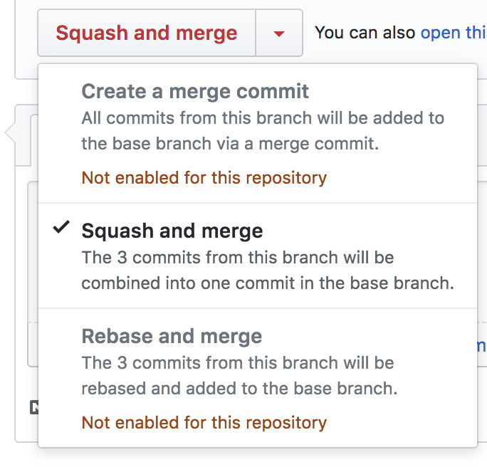

# Pull requests

The following outlines how to make changes to a repo. The goals are

- Focused PR's related to specific changes
- Code review is simple and manageable
- A clean tree of changes in the commit history
- Consistency across the commits

We also want to respect the time and effort of those reviewing the work. Keeping PR's small, focused and consistent makes their life easier.

## Always on a branch

No matter how small the change, all changes should be done on a branch and never directly to `main`. This is to support the principle of [main is always shippable](https://github.com/DEFRA/software-development-standards/blob/main/docs/principles/coding_principles.md#main-is-always-shippable)

Clone the repo then create your new branch. For example `git checkout -b add-ea-admin-area-lookup`.

## Start with a commit

Start your new branch with an empty commit.

```bash
git commit --allow-empty
```

The template for the commit is the following

```text
50 character limited title

Link to originating story/bug/card in relevant system (e.g. Jira or Trello)

Description covering why we're making this change, and briefly what the change is.
```

For example

```text
Handle empty params in ValidatePreUpdate method

https://eaflood.atlassian.net/browse/WAS-1096

This change fixes an issue found with `validate_pre_update_organisation_address` in that when passed empty parameters it would cause an `undefined method all? for nil:NilClass` error to be thrown.
```

The key point is that it should cover **the actual change you are intending to make**, and not just repeat **what the backlog story outlined**. The link to the story is added for those that need that greater context.

### Commit message rules

1. Separate subject from body with a blank line
1. Limit the subject line to 50 characters
1. Capitalize the subject line
1. Do not end the subject line with a period
1. Use the imperative mood in the subject line (*Add ability* not *Added ability*)
1. Use the body to explain *what and why* vs. *how*

N.B. The source for these is [How to write a Git commit message](http://chris.beams.io/posts/git-commit/) which you're encouraged to read.

## Let everyone know

Next push your branch.

```bash
git push -u origin add-ea-admin-area-lookup
```

We create a PR right from the start so that your proposed change is visible to all. This means everyone can feedback if they see any issues, and give help and advice.

Once pushed you'll need to go to GitHub to actually create the PR. Typically it will highlight the new branch in the UI and provide a quick option to create the PR. You'll then see GitHub automatically takes your first empty commit and uses it to populate the pull request title and description. Nice! Assign yourself to the PR so everyone knows the work is with you.

## Now code

Now get on and code. You should commit frequently and push often. Don't worry too much about your commit messages here. But don't ignore them completely as they will be used as part of the PR process (so keep `WIP`, `Still WIP`, and `More WIP!` to a minimum thank you!)

## Keep up to date

It's on you to keep your branch up to date with with your main development branch e.g. *main*. Using `rebase` rather than `merge` will mean no merge messages appearing in your PR's commit history, but its not required. To `rebase` on *main* use

```bash
git rebase origin/main
```

## Get it reviewed

When you're finished and have pushed your last commit request someone to review it. If there are multiple members on your team and all could review, feel free to request them all. The key thing is at least one other person should review the PR before it is merged.

You and the reviewer will then work to confirm the changes are OK. Once the reviewer is happy they need to **approve it**.

When code reviews are conducted to a high standard, they provide a valuable learning opportunity for the author, reviewer and any observers of the review process.

## Completing the PR

Once approved to complete the PR you'll need to `squash` your commits down to one.

The simplest way to do this is in the GitHub UI. Within the PR the merge button for new repo's will say `Squash and merge`. Else you may need to click the down arrow next to the button to select it.



When you click it GitHub will present a box which contains the combined text from all the commit messages in the PR. Use this opportunity to reword the content to a single commit message (the smaller the change the simpler this is to do!)

When done ensure you delete the branch. Again GitHub will present this option in the UI immediately after merging so make use of it then.

## Tips for reviewing PRs

### Tone of code review comments

The tone of communications is extremely important in fostering an inclusive, collaborative atmosphere within teams.

Remember that your colleagues put a lot of effort into their work and may feel offended by harsh criticism, particularly if you make assumptions or imply a lack of thought. Approach code reviews with kindness and empathy, assuming the best intentions and applauding good solutions as well as making suggestions for improvement.

Comments should be used to give praise for good solutions and to point out potential improvements. They should not be used to criticise your colleagues or make strongly opinionated statements. Always be mindful of your tone, considering how others might perceive your comments, and be explicit about when a comment is non-blocking or unimportant.

#### Be constructive

Don't use harsh language or criticise without making constructive suggestions.
Do suggest alternative approaches and explain your reasoning.

#### Be specific

Don't make vague statements about the changes as a whole.
Do point out specific issues and offer specific ideas for how the changes can be improved.

#### Avoid strong opinions

Don't make strong, opinionated statements or dictate specific changes.
Do ask open-ended questions and keep an open mind about alternative solutions and reasoning that you may not have thought of.

### Scope of a code review

Code reviews should focus on what is being changed and whether the change is appropriate. The scope will be stated in the acceptance criteria of the ticket.

Expanding the scope of a pull request at the review stage is not acceptable. It is generally more valuable to swiftly conclude a piece of work that the team has prioritised than to opportunistically seek additional changes, such as refactoring related code. That said, it can be useful to comment on refactoring opportunities without blocking the pull request.

### What to look for

#### Are the changes focused?

Are the changes focused on a specific issue, referenced in the pull request description? If the changes go beyond the intended scope, should they be broken up to make the code review more manageable?

#### Maintainability

Is all new code extensible and easy for other developers to understand? Does it follow common design patterns? Look for unnecessary complexity and remember that this is subjective so take care not to be overly critical or opinionated.

#### Duplication

Is there duplication within new code or between new and existing code? Could an existing abstraction be reused or should a new abstraction be created?

Identifying useful abstractions at the review stage may indicate that there wasn't enough collaboration before coding began. See this as a trigger to review the team's ways of working, rather than blocking a pull request unnecessarily.

#### Reusability

Have any new abstractions been introduced? Are they sufficiently reusable? If other parts of the system could be updated to use the new abstractions, consider suggesting this in a non-blocking comment.

#### Impact on other parts of the system

Will the changes have knock-on effects or otherwise necessitate changes to other parts of the system?

#### Unit test coverage

Is all new code covered by detailed unit tests? Have any edge cases been missed? Don't rely on metrics such as code coverage. Inspect the code thoroughly and ensure that the tests contain appropriate assertions to confirm that all the intended functionality works as expected.

#### Integration tests

Have integration tests been added to cover all changes to functionality?

### Concluding a review

When concluding a review, there are three options:

1. Comment
2. Approve the PR
3. Block the PR by requesting changes

#### When to comment

You should conclude with a comment when your review asks questions which need answering before you can determine whether the pull request is acceptable. If you haven't proposed a solution to a specific problem in the pull request, it's generally better to leave a neutral review than to block the PR with a request for change.

#### When to approve

You should approve a pull request when you have confirmed that:

1. it meets the objectives set out in its description
2. it doesn't introduce new defects or code that is hard to maintain
3. all new and modified code has thorough unit test coverage
4. integration tests have been added where appropriate
5. there are no unresolved questions or comments against the pull request

Occasionally, it may be prudent to accept a pull request which does not meet all of the above requirements, such as to resolve an urgent issue with the live product. Such cases must always be agreed between the product owner, author(s) and reviewer(s).

If comments or questions on a pull request have been addressed elsewhere (e.g. face-to-face or on Slack), ensure that the outcome is recorded in comment replies so that it is visible to anyone looking back at the pull request in future.

Use the Resolve button to make it clear which of your concerns have been addressed and which still need attention. A pull request should only be approved after all reviewers have explicitly indicated that each of their comments have been resolved.

Sometimes, a reviewer may become unavailable after commenting on a pull request. When that happens, a second reviewer may accept the pull request without resolving the first reviewer's comments, as long as the author and second reviewer agree that they believe all legitimate concerns have been addressed.

#### When to request changes

You should request changes to a pull request if any of the following are true:

1. it creates a defect in the product
2. it exacerbates an existing defect
3. it doesn't meet the objectives set out in its description
4. it would make the product more difficult to maintain
5. new or modified code lacks thorough unit tests
6. required integration tests have not been included

#### When **not** to request changes

> Perfection is the enemy of good

A pull request does not need to be perfect to be good enough. Often, there are many solutions to a problem and one which is not the best is still good enough to meet current needs.

Make suggestions for improvement as comments without explicitly approving or rejecting the pull request. This way, your suggestions can open dialogue with the author about how important your suggestions are compared to other work you could each move on to.
