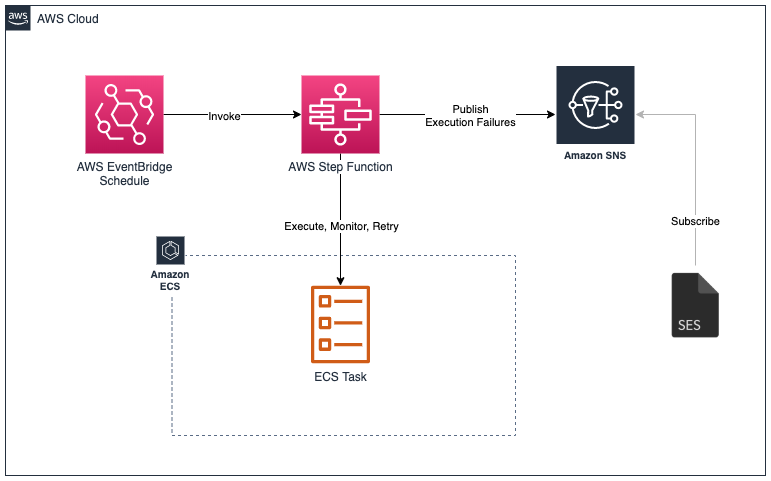
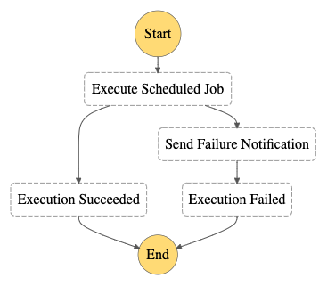

# Terraform script to set up a scheduled ECS Fargate task managed by Step Functions

This guide demonstrates how to set up an AWS Step Function to manage an ECS Fargate Task via a
scheduled event.

## How it works

## Step Function Definition

## Terraform Script

The Terraform script will perform the following actions:

- Create an ECS Fargate cluster and task definition to be executed
- Create an SNS topic to which failure notices will be published
- Create an AWS Step Function to:
    - execute, monitor and retry execution of the task in Fargate
    - notify an SNS topic should execution of the task fail
- Create an Amazon EventBridge rule to execute the Step Function on a defined schedule

The script can be found in the
[scheduled_ecs_fargate_task_tf_files](scheduled_ecs_fargate_task_tf_files) folder.
